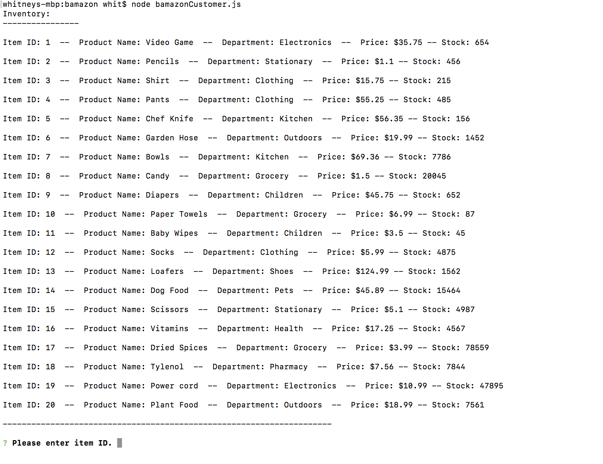
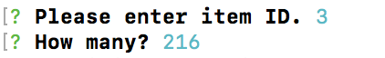
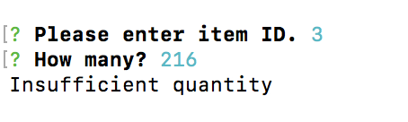
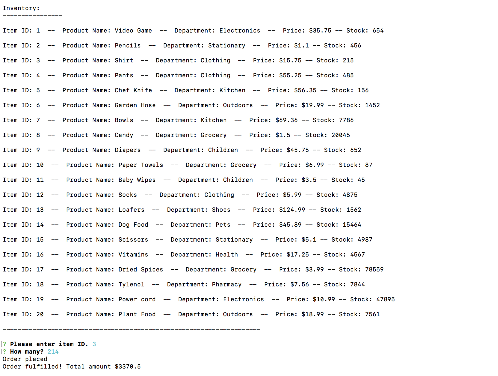
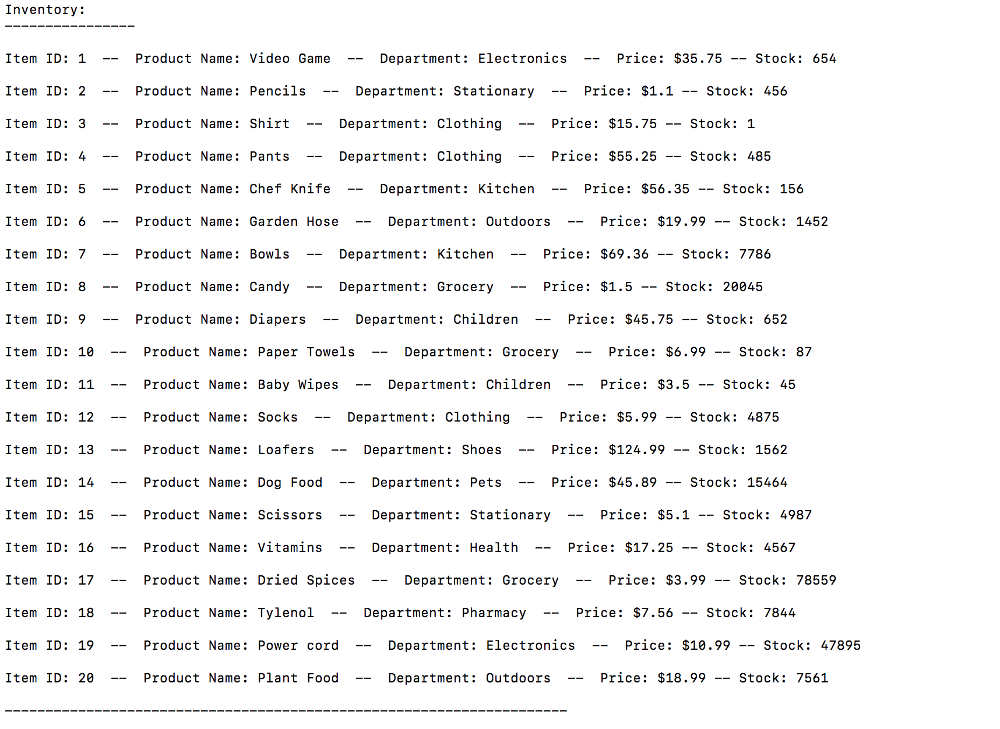

# Bamazon

## App instructions and details

Recording: http://g.recordit.co/yXrLW18OhE.gif

This is an example of an online store with a customer view, order placement, stock checker and updater. 

To begin use the CLI command “node bamazonCustomer.js” and you will be given a view of current products and inventory, as seen here:

You can order an item by submitting a id number at the prompt. You will then be asked the quantity. Seen here:

Your submitted order is checked against the database to see if there are enough items. If stock is too low to complete order you are given an appropriate message, seen below:

If your order is within stock limits it is completed and you are given an appropriate message including your total order amount.Seen here: 

When displayed again, the view of current products and inventory is updated to reflect new amount. Seen here:

